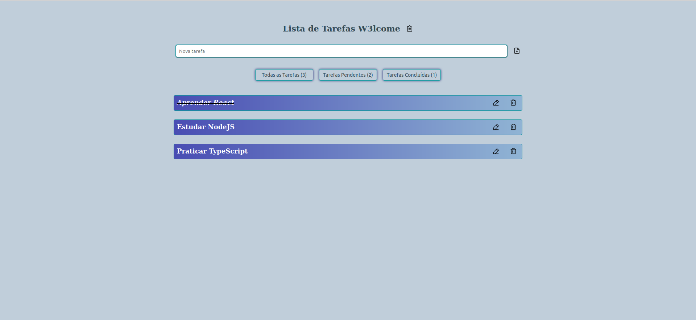

# desafio-W3lcome-fullstack

Esse projeto foi desenvolvido para um teste técnico!
O desafio foi desenvolver uma aplicação fullstack de um To Do List utilizando Typescript, React e Nodejs.

Aqui você vai encontrar os detalhes de como foi o desenvolvimento do projeto e quais foram os requisitos técnicos necessários para a entrega do desafio.

# Descrição:
Aplicação Fullstack onde é possivel realizar um CRUD de um To Do List com backend e frontend integrados.

# Habilidades desenvolvidas

Neste projeto, fui capaz de:

- Utilizar o banco de dados relacional MySQL;
- Utilizar o ORM Sequelize para trabalhar com o banco de dados MySQL;
- Construir uma API CRUD com Node.js e Express;
- Criar rotas para uma API com Express;
- Desenvolver Testes de Integração no backend;
- Estilizar uma página web com CSS;
- Desenvolver aplicação Frontend com React e Typescript;
   
---

# Funcionamento da aplicação

Para iniciar o projeto, é necessário possuir o [Docker](https://docs.docker.com/engine/install/ubuntu/) instalado.

⚠ **Atenção:** ⚠
- Deve-se mudar as variáveis de ambientes localizadas no docker-compose na raiz do projeto e no .env no diretório do ./server.

**Instalação de dependências na raiz do projeto:** 

```
git clone git@github.com:kaioruan/desafio-w3lcome.git
```

**Utilizando o docker**

```
docker-compose up
```


Após isso, você pode acessar a aplicação através do endereço http://localhost:3000/.

# Sobre os testes
## Executando todos os testes

Para poder executar os testes, na raiz, utilize o comando o comando `npm run test` e **todos** os seus testes serão executado.

---

<p align="center">

</p>
